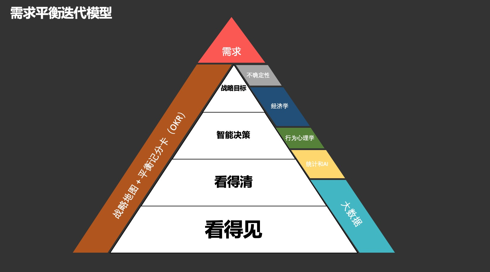

# 风险控制笔记
2014年6月我开始从事风控相关的工作，和几位优秀的工程师一起组建了唯品会的风控团队。2016-2020年在爱奇艺，负责业务安全运营、威胁情报工作。

这里是我这5年来风控经验的总结，希望可以帮助刚入风控行业的人了解一些基础，也希望谈一谈我对于风险控制独到的理解。

如果你是一个新人，可以先从基础篇看起，了解一些业务风控的基础概念和防控思路。如果你已经在这个行业多年，可以看看我筛选出来的精华文章，看看我是如何借用经济学、金融学、心理学理解风控，也许你也会有新的发现。

# 精华文章
* [什么是风险](什么是风险.md)
* [精细化运营](精细化运营.md)
    - [决策的第一步-看得见](决策的第一步-看得见.md)
    - [决策的第二步-看得清](决策的第二步-看得清.md)
    - [影响量化评估的两个要素](影响量化评估的两个要素.md)
* [建设风控大数据团队](建设风控大数据团队.md)
* [案例：爱奇艺业务风控系统](爱奇艺业务风控系统.md)

# 目录

## 基础篇
* [利益](利益.md)
* [异常发现](异常发现.md)
* [多维度判断](多维度判断.md)
* [限制频率](限制频率.md)
* [IP风险识别](IP风险识别.md)
* [手机号风险识别](手机号风险识别.md)
* [设备风险识别](设备风险识别.md)
* [用户业务行为习惯](用户业务行为习惯.md)
* [阈值的选取](阈值的选取.md)
* [高危名单](高危名单.md)
* [规则和模型](规则和模型.md)
* [验证手段](验证手段.md)

## 基础拓展篇
* [蜜罐](蜜罐.md)
* [使用图技术进行管理分析](使用图技术进行管理分析.md)
* [用户设备行为习惯(生物探针)](用户设备行为习惯.md)

## 运营篇

2019年2月，我提出了“看得见、看得清、智能决策”的运营模型，结合卡普兰教授的“战略中心型组织”、卡尼曼的行为心理学知识框架，设计了我自己的需求平衡迭代模型。这个模型可以应用在很多领域，但是在本项目中，我将会围绕在风控领域进行介绍。

* [精细化运营](精细化运营.md)
    - [决策的核心问题-看得见](决策的核心问题-看得见.md)
    - [决策的核心问题-看得清](决策的核心问题-看的清.md)
* 数据量化和效果评估
    - [影响量化评估的两个要素](影响量化评估的两个要素.md)
    - [风控效果量化评估](风控效果量化评估.md)
* [什么是风险](什么是风险.md)
* [安全从自身做起](安全从自身做起.md)
* [让风控贯穿产品](让风控贯穿产品.md)
* [谈判技巧](https://github.com/WalterInSH/negotiation-skills)

## 团队发展篇
* [建设风控大数据团队](建设风控大数据团队.md)

## 案例篇
* [爱奇艺业务风控系统](爱奇艺业务风控系统.md)

## 结束
* [写在最后](写在最后.md)

### 共享你的力量
如果你也想分享你的知识，帮助更多人了解风控；或者你发现任何错误，可以提Issue，也可以发送邮件到 walterinsh@icloud.com
