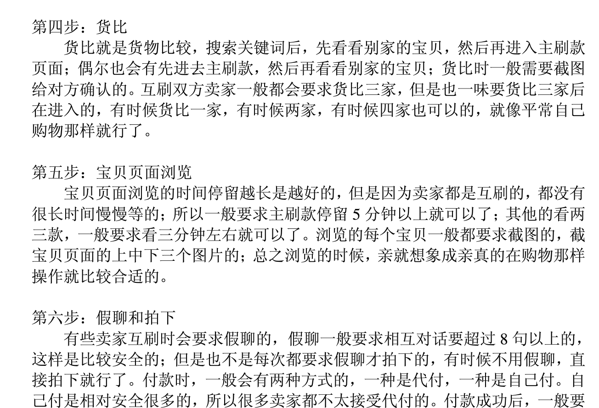

# 历史业务和行为数据

现在的大型网站都会记录用户的行为，例如用户的浏览记录、停留时长、输入密码的速度、按钮点击等。我们可以用这些数据佐证我们对用户的验证。

### 一个用户的历史行为

我们可以收集一个用户的历史的业务数据和行为数据，给这个用户打一些标签。例如

|用户| 历史数据 | 标签 |
| -- | -- | -- |
|Jim| 用户购买了10次，平均每次花100元 | 每次消费能力较低 |
|Lily| 用户购买了15次，平均每次花1000元 | 每次消费能力较高 |
|Hunk| 10次下单中9次购买零食 | 大部分订单为食品类 |
|Hunk| 历史余额提现都提到了招商银行 | 用户习惯用招商银行 |

基于一个用户的历史得到标签后，我们假设用户很少改变自己的习惯，所以每当用户做出违反自己习惯的行为时，我们可以对用户的行为多一些验证。

例如上面的Hunk，Hunk要将余额提出来（提现），这次新绑定了一张工商银行的卡，我们发现他从来没有向这张卡提现过。有可能是盗号提现，也有可能Hunk刚刚办了一张新卡。我们不妨向Hunk绑定的邮箱或者手机发一个消息，提醒一下。

### 类似用户的通常行为

有时候形容一个用户的习惯很难，因为我们需要为这个用户积累一些数据之后才能给一个准确的标签。另外，我们虽然假设用户很少改变用户习惯，但是总是有善变的用户。这时我们可以试试给一类用户打标签。

|用户群| 标签 |
| -- | -- |
|大部分用户| 在下单前会在多个同类商品中比较一下 |
|参加某次活动的用户| 都是从B页面跳转过来的 |

同理，我们就可以基于这些标签，对违反用户习惯的请求进行验证。

例如“参加某次活动的用户，都是从B页面跳转过来的”，大部分黑产的人都带有极强的目标，刷活动的时候往往只关注活动页面，而且他们为了省时间会通过技术手段直接跳到活动页面。但是大部分正常用户会从一个宣传页跳转过来，例如从首页的广告跳到活动页面，再通过某个按钮参加。

### 实例

很多电商上面都会给商家评级，例如“皇冠”、“钻石”，不同评级的商家会有不同的曝光率，相应的收入也是天壤之别。评级的标准里订单量会是一个重要的指标。所以商家会联合专业刷单一起伪造很多订单。

很多防范商家刷单的原理就是从交易中找到那些违反正常用户习惯的交易，例如

1. 用户是否是从搜索页面找到的商品
2. 用户是否浏览了3个以上的商品
3. 用户每个商品浏览的时间是否大于30秒
3. 用户是否和商家有沟通
4. 用户下了大量订单，但是均价极低
5. 用户是否有申请过售后
6. 用户是否评价过

如果系统检测到类似的交易，订单可能会被暂时冻结，进入一个更细致的分析阶段，甚至抽样进行人工审核。如果证实的用户、手机号、银行卡会被存入黑名单。

### 黑产的应对策略

类似的方法会给黑产制造很多麻烦，因为他们要尽量表现的向正常用户，这会让他们的动作变得慢下来，从而让他们相同时间内的获利减少。但是，这并不能完全阻止黑产。

下图是从黑产流出的教程

