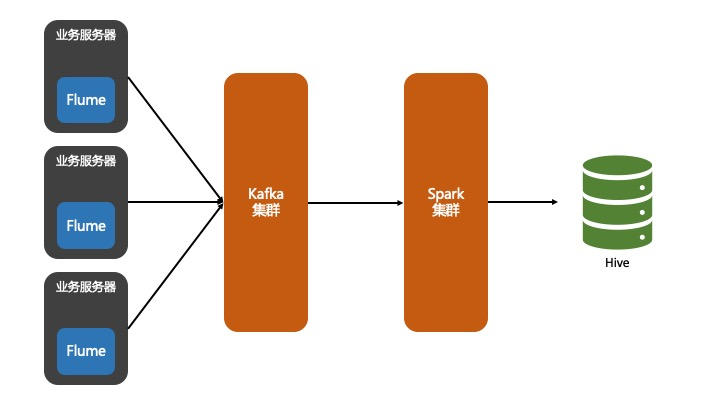
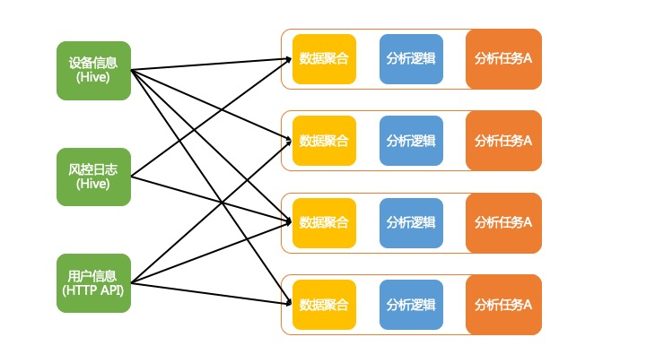
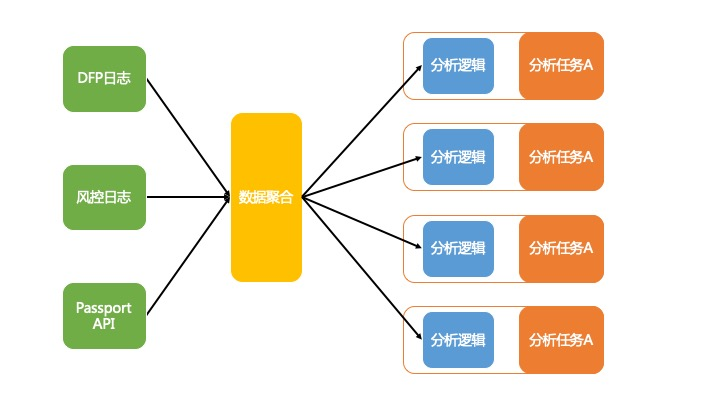

# 决策的核心问题-看得见

开篇提到解决“看得见”这个问题，也就是解决数据的获取问题，分为3个子问题：
1. 数据是否被存储了？
2. 数据能否可以被快速、灵活的访问？
3. 数据能否可以被关联分析？

本章我们将使用登录场景的分析案例来讲解。请以自己的网站或应用为例，试着回答一下这几个问题：
1. 你的网站或应用的登录失败率是多少？
2. 登录量上升 + 登录成功率下降，让你很紧张，那么你是受到攻击了吗？

### 数据的存储

要回答上面的问题，至少你要有登录日志，我相信大部分公司都会存。但如果你只存了登录日志，而没有存验证日志，那你就很难回答第2个问题了。下面这2种可能都可能在特定时期导致登录量上升 + 登录成功率下降
1. 黑产真的来撞库了
2. 验证码服务升级，提高了验证难度


所以，如果你的数据一开始就没有被存下来，那么你就真的只能靠猜了。

### 数据的访问

除了存日志，你的日志还加了充足的字段，例如：IP、时间、验证码类型、验证码服务版本、客户端版本、设备号等等。这很好，给未来的分析开了个好头。可是这也带来了问题：**我增加了日志，增加了字段，我的业务很好，可是数据量太大了，我用excel打不开**

这里的excel是一个比喻，但也不是个比喻。

随着数据量增大，要想访问数据就需要大数据工具，例如Hive、Spark、Hbase、Cassandra、Elasticsearch。我相信稍微大一点的公司都有使用。但是 **使用大数据技术不代表数据可以被快速、灵活的访问。**

#### 常见问题一：数据没有被整理

很多重要的业务数据混杂在一个大的日志文件中，例如这样产生的日志

```
System.out.println("user " + userId + " logged in at " + time)
or
Logger.info("user {} uploaded a photo at {}", userId, time)
```

用户行为虽然记录到了日志中的，但是不同行为日志混在一起，甚至还包含代码的报错堆栈信息。如果日志格式没有规范，事后想要排查问题都很难，更不要提做分析。

常见方案：有价值的日志应该按照便于后期处理的格式打印到单独文件中。然后使用Apache Flume + Kafka + Spark转存到Hive中。



#### 分析师没有入口可以查询


### 数据的关联分析




