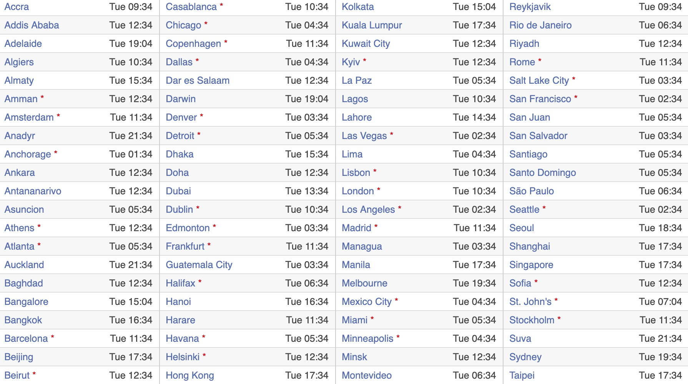
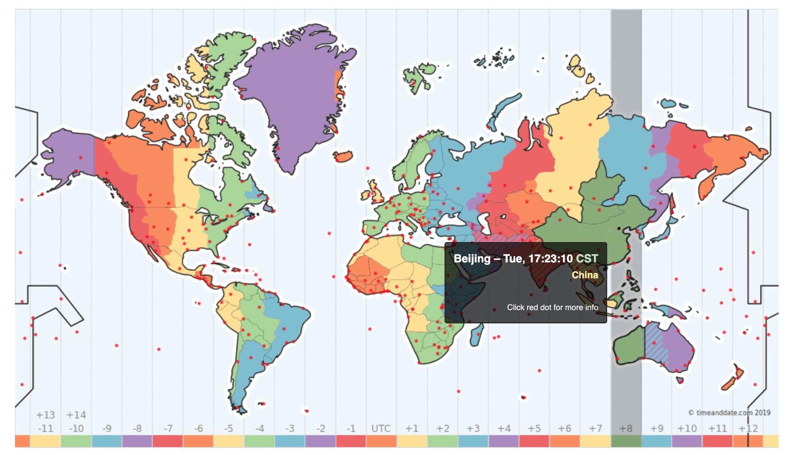

# 决策的核心问题-看得清

前文提到解决“看得清”这个问题，也就是解决数据的理解问题，分为3个子问题：
1. 能否量化业务，从而精确还原客观事实？
2. 能否制定合理的核心指标，从而化繁为简、提高运营效率？
3. 能否建立合理、灵活、快速的可视化体系，从而提高人的理解？

### 业务量化

#### 精确的量化评估体系存在吗？

KPI刚刚在国内流行的时候，我参加过一个公司培训。

>讲师：KPI一定要可以衡量，不能是模糊的。例如“实现增长”就不是一个好的目标。
>
>某位同事提问：我觉得有时候我做的事没办法评估，怎么办？
>
>讲师：肯定是有办法评估的，没有什么是不能量化的。你不能量化是你没有好好思考。

这位同事还是一脸疑惑，但再接着问就很尴尬了，因为讲师的意思是“你不能是你水平不够”，再问问题更显得自己水平不够，而且还显得自己不愿意动脑。

之后的几年我一直在思考“没有什么是不能量化的”这句话，直到学了经济学之后，我有了我的结论：

**结论一**：很多实物是可以准确量化的，例如一张桌子的高度

**结论二**：对于抽象的价值，也许存在完美的量化体系，但是这个量化体系会有极高的交易成本。"交易成本"是经济学的术语，你可以理解为：即便完美的量化体系存在，维持这个体系的成本也会很高

拿“招到了一名员工的价值”举例:
```
老板问：这个月招聘工作咋样啊？
员工：招了3个人（可计数的实物）
老板：对业务有什么帮助吗？（抽象的价值）
员工A：帮助挺大的，解决了那个团队没有前端开发的问题
老板：我是问你价值，对项目有啥帮助吗？
员工：因为招的是还没经验的实习生，这个月还没什么明显产出，老员工带新员工自己效率还降低了，影响了项目进度
老板：你的意思是负价值吗？
员工：以后培养好了，肯定对团队有帮助的（一件事往往包含短期价值和长期价值）
老板：这个帮助的价值是多少？
员工：那个项目以后做完了可以盈利1个亿，没有这几个人，肯定做不完。招聘的价值就写1个亿吧。（确实能找到关联的数字）
老板：这怎么行？！哪部分是这几个新员工做的啊？
员工：我让他们写日报给我，让他们写清楚每个人产生的价值（写日报增加了成本）
实习生：我也不知道我做了个页面的价值啊（问题并未解决）
员工：肯定可以量化的，你多想想（成功把皮球踢出去了）
```

这里不是要黑HR，只是招聘是一个十分常见的事情，希望没有风控经验的人也可以理解量化评估的难点。这些难点大致有：
1. 很多事情的价值是长期的，短期价值不明显，甚至有可能是负的，未来的事情又不能准确预测
2. 很多事情的价值是通过价值网络产生的，也就是说一件事情本身独立存在时是没有价值的，当加入到另一个网络时就会产生价值，很难说一个节点的加入可以增加多少价值。例如一名出租车司机加入网约车平台，对平台的价值
3. 虽然能找到一些关联的客观数字，但不能都选；各个数字都有侧重点，又说不清选哪个
4. 即便是同一个数字，不同人也会有不同的价值感受
5. 量化评估本身就需要花时间，调研、记录、分析、汇总、讨论都需要花时间。当评估需要依赖其他人或团队时（其他人又可能需要依赖其他更多的人），沟通讨论也有成本。自动化是个好办法，但是开发和维护自动化系统也是需要成本的。算一算量化评估的时间有可能已经超过了做事情的时间

所以我的意思就是别量化了吗？不是的，我的意思是要明白 **精确的价值量化的成本是极高的，甚至是理论上不可能的。我们能做的是在有限的成本内做量化**。

>技术可以提高，但理论的极限无法突破，不要做徒劳的事情。
>
>我们所能做的事情，不过是在边界内找到相对好的答案。
>
>          ————吴军 《谷歌方法论》

既然和成本有关，那么提升方案也就很明显了：
1. 增加量化评估的投入。例如增加评估的时间、人力
2. 增加量化评估效率。例如系统设计时考虑评估数据的记录、评估理念的革新、工具的改进等

需要注意的是，这里存在一个正反馈：更好的理念可以优化分析效率，优化量化评估效率，优化量化评估成本，优化量化评估准确性，又可以给我们带来新的理念。

当然了“正反馈”也意味着如果你做的差，就会导致链条中其他步骤做的更差，形成恶性循环。


### 业务核心指标

解决了“看得见”的问题，也知道了量化的边界

我们获取到了很多数据，我们可以定出很多指标。例如请求量、拦截量、二次验证量。那我们到底该看哪些指标呢？

都看可以吗？当然可以，但是没必要。在爱奇艺我设计了一个系统叫“深度分析”，说起来也简单，就是输入一批用户，看这批用户在爱奇艺所有的行为指标。最后结果有好几页。要是每个统计认真看过去，可能要花3-5分钟才能看完。实际上如果真的是攻击，靠其中1-3个指标就已经可以大致定性了。

如果我们称这几个指标为核心指标，那核心指标是什么呢？答案是要看是什么业务风险。例如密码尝试次数和错误率是一个不常用的指标，绝大多数问题不会考虑这个指标。但是在撞库问题中，就成了核心的指标，需要重点关照。

所以对于你自己的业务，要思考一下你最关心什么，哪些指标可以带来更多信息。然后把重心放在这些核心指标上。

其他指标就不需要了吗？不是的，在给出最终判定前，最好再花一点时间看看其他指标。主要是为了看看还有没有别的可能，避免确认偏误(Confirmation Bias)、后见之明偏误(Hindsight Bias)等心理偏误。

>It is easier to construct a coherent story when you know little, when there are fewer pieces to fit into the puzzle. Our comforting conviction that the world makes sense rests on a secure foundation: our almost unlimited ability to ignore our ignorance.
>
>Kahneman, Daniel. Thinking, Fast and Slow

### 可视化分析

当你确定了业务风险，量化并制定出了核心指标，于是就可以利用机器对业务进行自动化分析和监控了。但是除了让机器理解你的问题，人也得理解。这个时候可视化能力就很重要了。

可视化不仅可以加快对数据的接受速度，也可以加深对数据的理解。

拿当前世界各地的时间信息为例，普通的表格可以提供完整的信息。通过筛选也可以快速找到某个城市的时间。但是却很难宏观的理解数据，发现城市和城市之间的关系。



将信息通过时区地图可视化出来之后，就变得更容易理解。例如你可以看到中国全境采用的是北京时间。但是美国本土区分了好几个时间。


