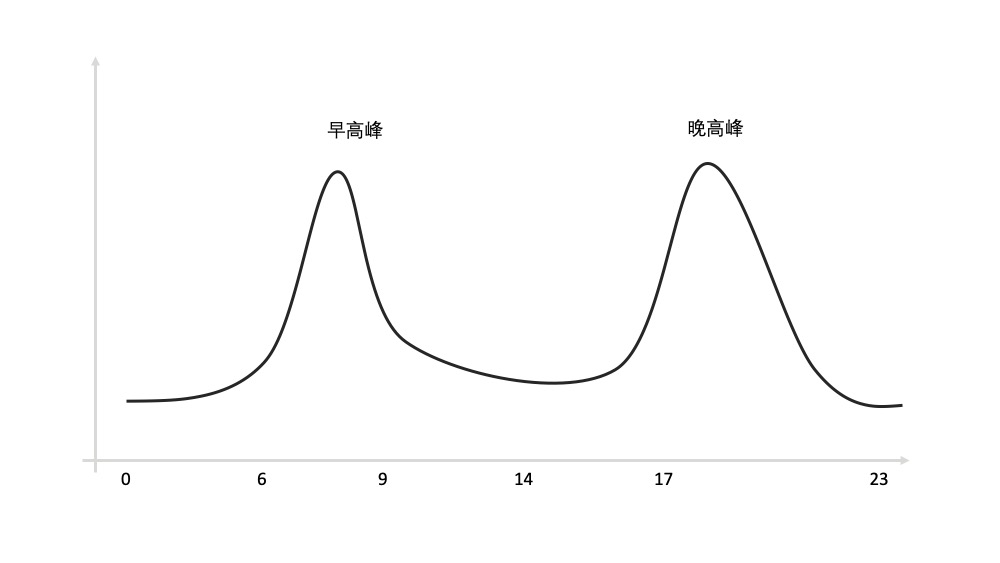
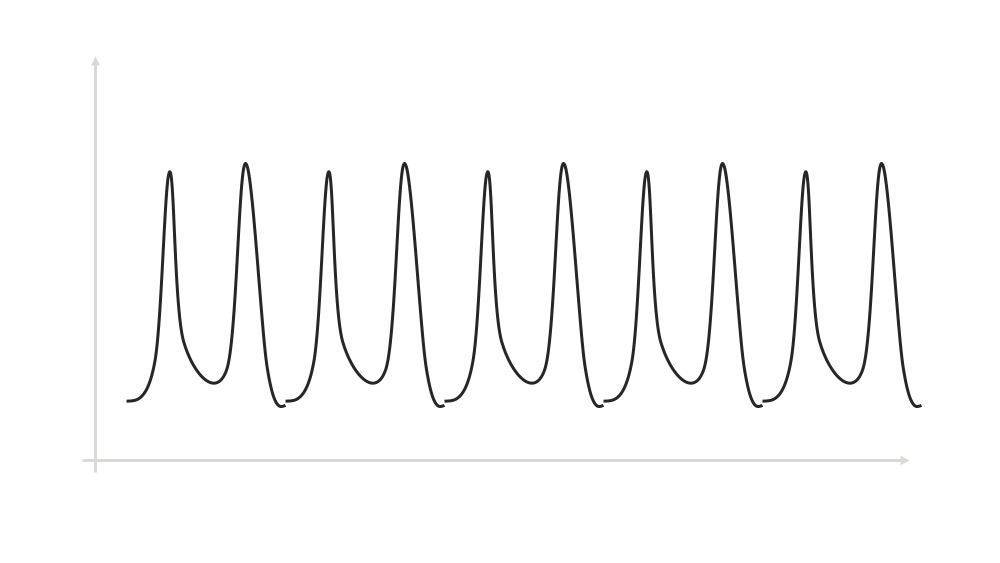
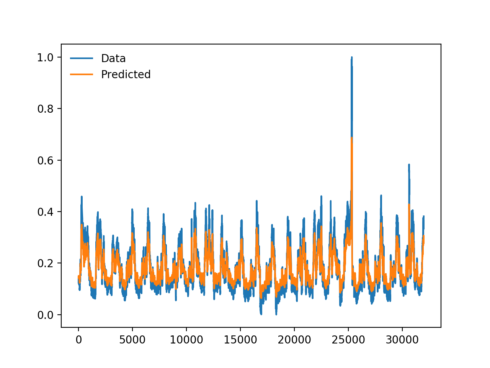

# 时间序列检测

除了通过请求频率判断是否有异常，还可以通过请求的时间序列来发现异常（异常不代表有攻击）。

时间序列可以理解为指标随着时间变化的规律。用地铁客流量来举例，一天中客流量应该类似下图，会有明显的早晚高峰。

假设不考虑节假日，将多天的数据连起来看，差不多如下图。有明显的波动规律。所以如果某一天实际客流量不符合这个规律了，大概率是发生了什么事情，例如附近在举办大型的展览。

### LSTM

简单的频率比较容易识别，使用SQL或者某种计数系统就可以实现。但是这种时间序列的异常应该怎么识别呢？这就要提到最近几年被广泛使用的LSTM模型。

Long Short Term Memory(LSTM)是 递归神经网络（Recurrent Neural Network）的一种，具体的原理可以自行Google。这里你需要知道的是使用LSTM可以很方便的对时间序列进行检测，特别是使用TensorFlow 2.0。

下图是使用TensorFlow预测的结果。

具体例子可以参考[TensorFlow 时间序列预测](https://www.tensorflow.org/tutorials/structured_data/time_series)的例子。
